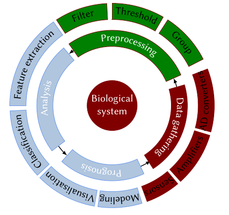

# 2020-09-22

## Temos

- Python
- IPython
- Python sintaksė
  - Duomenų tipai
  - Teksto spausdinimas
  - Funkcijos
  - Pakuotės
  - Programos eigos kontrolė


## Programavimas

- Kam reikia?
- Kokią programavimo kalbą pasirinkti?
- Kokius įrankius naudoti?
- Kaip tobulėti?


### Užduotys skirtinguose etapuose



### Programavimo kalbos

- C
- Java
- JavaScript
- SQL
- Matlab
- R
- Python
- Julia
- etc..

[Paprasto kodo pavyzdžiai su skirtingom kalbom](https://www.scriptol.com/programming/hello-world.php)

## Python

Python diegimas aprašytas skirtingom OS pagrindiniame
python [puslapyje](https://www.python.org/)

Paprasčiau sudiegti izoliuotomis aplinkomis kaip [anaconda](https://anaconda.org/) ar [canopy](https://www.enthought.com/).

Python interpretatoriai:

- Python 2
- Python 3
- IPython

Python [dokumentacija](https://docs.python.org/3/tutorial/index.html)

Python programų plėtinys .py

Terminale galime paleisti python programas rašydami:

```python
!python ../lab/programa.py
```

## [IPython](jupyter.org)

Duomenų analizę atlikti palengvinantis interpretatorius.
Iš matlabo ir kitų programų pasiėmęs įvairių funkcijų:

TAB klavišas užbaigia arba pasiūlo komandas.

Buvusių komandų pasiekimas Ctrl-r/n/p

Sesijos kontrolė

- Ctrl-l teksto ištrynimas terminale
- Ctrl-c nutraukia komandos vykdymą
- Ctrl-d exit

Platesnė pagalba, informacija apie funkcijas:

```python
help(len)
```

```python
len?
```

```python
len??
```

### Komandinės eilutės komandos

```python
cd .
```

```python
ls
```

```python
!man ls
```

```python
dir = !find . -type d
dir
```

### Magiškos komandos: %cpaste, %run,  %pip, %conda

```python
conda info
```

```python
%run ../lab/programa.py
```

### Komandų istorija

```python
%history -n 1-4
```

Paskutinė išeiga

```python
print(_)
```

```python
a = 5
a
```

```python
Out[5]
```

```python
b = 4
```

```python
In[-1] + In[-2]
```

```python
42 in Out
```

### Kintamųjų valdymas

- Informacija apie kintamuosius:

```python
who
```

- Kintamųjų pašalinimas

```python
%reset
```

### Visos komandos

```python
%magic
```

[dokumentacija](http://ipython.org/)

## Python sintaksė

Raktiniai, rezervuoti raktažodžiai

<!-- #raw -->
   False      await      else       import     pass
   None       break      except     in         raise
   True       class      finally    is         return
   and        continue   for        lambda     try
   as         def        from       nonlocal   while
   assert     del        global     not        with
   async      elif       if         or         yield
<!-- #endraw -->

[Komentarai](https://www.python.org/dev/peps/pep-0257/) svarbi kodo dalis.
Komentarų pagalba galime padėti sau pačiam ateityje susivokti kas kam.

```python
#!/usr/bin/env python37
# -*- coding: utf-8 -*-

2+2 # Comment is ignored

def function_name():
    """ docstring example

    This comment is accesible from .__doc__  atribute
    """
```

```python
# help(function_name)
print(function_name.__doc__)
```

### Kintamieji

```python
# Integers
10
10
0b10
2
# Float
type(3.14)
float
4e2
400.0
# Boolean
type(True)
bool
# Complex
type(3+4j)
complex
# Strings;
path = '~/Documents/bioa/data'
```


### Operatoriai

operatorius| reikšmė
---|---
$+$  | suma
$-$  | skirtumas
$*$  | sandauga
$**$ | kelimas laipsniu
$<$  | mažiau
$>$  | daugiau
$==$ | lygu
$!=$ | nelygu
$<=$ | mažiau arba lygu
$/$ | dalyba
$//$ | dalmuo 
$\%$ | liekana

```python
5/2
```

```python
5//2 
```

```python
5%2
```

### Sąrašai (list)

```python
list()
# mutable, ordered objects
a = [1, 'text', True,'3.14', len, int]
# [1, 'text', True, '3.14', <function len(obj, /)>, int]
a
```

Pasiekimas elementų sąrašuose:

Skaičiavimas prasideda nuo 0

```python
a[0]
```

iš kitos pusės nuo -1

```python
a[-1]
```

Iškirpimas dalies sąrašo (slice)

```python
a[1:4]
```

Apvertimas

```python
a[::-1]
```

Trumpos komandos elementų paeiškai ar palyginimui

```python
a
```

```python
1 in a
```


```python
1 is a[0]
```

```python
1 == a[0]
```

```python
b = 257
257 is b
```

```python
257 == b
```

Dimensijų pridėjimas

```python
b = ['nested',a]
b
```

```python
b[1][1]
```

#### [Įmontuoti metodai](https://docs.python.org/3/library/functions.html)

```python
len(b)
```

```python
type(b)
```

```python
round(23.99)
```

### Kortežas (Tuple)

Nekintantis objektas, sudaromas iš bet kokio tipo duomenų.
Sukuriamas `tuple()` komandos pagalba arba `()`.
Elementai atskiriami kableliu.
Vieno elemento tuple sukuriamas `(x,)`.

Kortežai veikia greičiau negu sąrašai,
neleidžia keisti vertes ir naudojami žodynų formavimui.

```python
tuple()
# immutable
t = ('a','b','c')
t
```

```python
42, 'text'
```

```python
a,b,c=t # unpack
a
```

### Žodynas

Sąrašas kuris sudarytas iš rakto - vertės porų
ir jo elementai pasiekiami rakto pagalba vietoje indekso.
Raktas turi būti unikalus ir nemodifikuojamo tipo
(tuple, integer, string, float, boolean), vertės gali būti bet kokio tipo.

```python
dict()
# mutable, dynamic, nested, elements accessed via keys
human = {}
human
```

```python
type(human)
```

```python
human['name'] = 'John'
human['gender']='male'
human['age']=40
human
```

```python
{'name': 'John', 'gender': 'male', 'age': 40}
```

```python
{(1,1):45, (1, 2):5}
```

```python
human.keys()
```

```python
human.popitem()
```

### Aibė (set)

Modifikuojamas nesutvarkytas, unikalių duomenų rinkinys
sukurti galima komanda `set()`


```python
set()
s = 'quux'
list(s)
```

```python
set(s)
```

## Teksto spausdinimas

```python
print('long senctence\
      can be divided into \
      parats using \\')
```


|kaip rašosi|komanda|
|-----------|----------|
|\t|tab|
|\n|nauja eilutė|
|\r|Enter|
|\b|Atgal|
|\\|pasviras brūkšnys \|
|\'|kabutė|
|\"|dviguba kabutė|

## r strings

```python
print(r'raw\nkeyward\tprints all symbols\\')
```


Jei paprastai

```python
print('raw\nvkeyward\tprints all symbols\\')
```

### f strings

```python
name = 'John'
age = 22
"Name:, %s. Age: %s." % (name, age)
```

```python
"Name, {0}. Age {1}.".format(name, age)
```

```python
f"Name, {name}. Age {age}."
```

```python
f"Name, {name.lower()}. age {age}."
```

## Pakuotės

Importuoti reikia taip kad nepersidengtų skirtingų bibliotekų funkcijų vardai.

```python
import math
math.sqrt(4)
```

```python
from math import sqrt
sqrt(4)
```

```python
from math import *
sqrt(4)
```

Python pakuotes, versijas ir aplinkas valdom:

- Anaconda leidžia ir atsisiųsti programas duomenų analizei,
atlikti ir tvarko versijas pakuočių.
- Daugiau Python pakuočių galima atsisiųsti iš oficialios
python pakuočių bibliotekos su  pip programa ([Python Package Index](https://pypi.org/))


Pravartu kodą atliekanti skirtingus uždavinius skirstyti į atskirus failus ir prireikus importuoti.
Taip programa tamp švaresnė\skaitomesnė, lengviau suprantama.
Atskiras izoliuotas programas galima panaudoti daug kartų.
Taip pat lengviau rašyti ir testuoti.

```python
import programa2
```

```python
programa2.tekstasA()
```

```python
%run programa2.py
```

### Funkcijos

Funkcijos apibrėžiamos `def` raktiniu žodžiu:

```python
def functionName(inputVariable):
    #  somethingis done here
    return something
```

$Celsius = (Fahrenheit - 32) * 5.0/9.0$

$Fahrenheit = 9.0/5.0 * Celsius + 32$

```python
def celcius_to_farenheit(celcius):
    fahrenheit = 9.0/5.0 * celcius + 32
    return fahrenheit, celcius

celcius_to_farenheit(36)
```

```python
output = celcius_to_farenheit(0)
output
```

## Kontrolė eigos programos

- Dvitaškis po formuluotės
- Visur vienodi tarpai (tab vs space)

### If

```python
x = int(input("Please enter an integer: "))
```

```python
if x < 0:
    print('įvestas neigiamas skaičius')
elif x == 0:
    print('įvestas nulis')
else:
    print('įvestas teigiamas skaičius')
```

Funkcijų deklaravimo metu galime nurodyti numatytuosius kintamuosius.
Kreipiantis į funkciją tokius kintamuosius galime praleisti
arba kreiptis į juos vardu ir nepaisyti eiliškumo

```python
def convert_to_SI(value, type='temp', beta=5):
    ''' supported types:
            temp (fahrenheit input, celsius and kelvin outputs)
            dist (inches input, meters output)'''
    if type == 'temp':
        celsius = (value - 32) * 5/9
        kelvin = celsius + 273.15
        return round(celsius), round(kelvin)
    elif type == 'dist':
        meters = value * 0.0245
        return(meters)
    else:
        print(f'Type is not defined, beta is {beta}')
```

```python
convert_to_SI(33, 'temp')
```

```python
convert_to_SI(value=3, beta=4, type='temp')
```

```python
convert_to_SI(33)
```

### For

```python
for x in [1,2,3]:
    print(x)
```

```python
values_in_fahrenheit = [0,44,56,788]
values_in_celsius= []
values_in_kelvin= []

for value in values_in_fahrenheit:
    cel, kel = convert_to_SI(value)
    values_in_celsius.append(cel)
    values_in_kelvin.append(kel)
```

```python
values_in_kelvin
```

### Range

range([start], stop[, step])

```python
for i in range(4):
    print(i)
```

```python
range(-10, -100, -30)
```

```python
list(range(4))
```

```python
for i in range(4):
    print(i)
    i = 10
```

```python
from time import sleep
def progress(percent=0, width=30):
    left = width * percent // 100
    right = width - left
    print('\r[', '#' * left, ' ' * right, ']',
          f' {percent:.0f}%',
          sep='', end='', flush=True)


for i in range(101):
    progress(i)
    sleep(0.1)
```

Atvirkštine tvarka

```python
for i in reversed(range(1, 10, 2)):
     print(i)
```

#### For su žodynais

```python
data = {'-18': '255', '7': '280'}
for k, v in data.items():
    print(f'Celsius: {k}, Kelvin {v}')
```

#### Enumerate

```python
a = ['a', 'b', 'c'];
for i, v in enumerate(a):
    print(i, v)
```

```python
for i in range(len(a)):
    print(i,a[i])
```

#### Zip

Norėdami vienu metu iteruoti per keletą sąrašų naudojame zip funkciją

```python
for q, a in zip(values_in_fahrenheit, values_in_celsius):
    print(f'Temperature in celsius {a} equals {q} in fahrenheit')
```

### While

```python
a, b = 0, 1
while a < 10:
    print(a)
    a, b = b, a+b
```

#### Begalinės iteracijos

<!-- #raw -->
while True:
    print('a')
<!-- #endraw -->

```python
import random
x = 0
while x<0.9:
    x = random.random()
    print(x)
```

### Break ir continue

Break nutraukią for arba while ciklą.
Continue tęsia ciklą su sekančia iteracija

For ciklo else sąlyga yra įgyvendinama jei ciklas
nebuvo nutrauktas  break raktinio žodžio.

```python
for n in range(2, 10):
     for x in range(2, n):
         if n % x == 0:
             print(n, 'lygu', x, '*', n//x)
             break
     else:
         print(n, 'is a prime number')
```

### Pass

Raktinis žodis `pass` nedaro nieko.

```python
for i in range(4):
    pass
```

## Comprehensions

[Dokumentacija](https://docs.python.org/3.9/tutorial/datastructures.html#list-comprehensions)

Sąrašus python programavimo kalboje galime kurti keliais būdais.
Pavyzdžiui jei norime sukurti sąrašą elementų nuo 1 iki 100

```python
listA = list(range(1, 101))
print(listA)
```

Bet jei norime sukurti šiek tiek sudėtingesnį sąrašą
turintį tam tikrą logiką tenka išplėsti aprašymą.

Jei norime sukurti sąrašą skaičių
kūbų nuo 1 iki 10 galime naudoti `for` ciklą

```python
listB = []  # sukuriam tuščią sąrašą
for i in range(10):
    listB.append(i ** 3)

listB
```

Tikslui galime panaudoti `map` funkciją.
Ji daug greitesnė ir jos sintaksė lengvina programos skaitomumą.

```python
def cube_function(x):
    cube = x ** 3
    return cube

listB = map(cube_function, list(range(10)))
list(listB)
```

Bet tokiems paprastiems uždaviniams spręsti gerai turėti
mažai rašymo reikalaujantį metodą.

```python
listB = [x ** 3 for x in range(10)]
listB
```

Padalinam `list comprehension` metodą į dalis

Pirmiausiai nusprendžiame kokio tipo atsakymas bus

- sąrašus apsupam laužtiniais skliaustais []

```python
listB = [x ** 3 for x in range(10)]
listB
```

- Aibę (set) apsupam riestiniais skliaustais {}

```python
listB = {x ** 3 for x in range(10)}
listB
```

- Žodynus kurdami nurodome raktą ir jo vertę

```python
listB = {x:x ** 3 for x in range(10)}
listB
```

- Kortežą kuriam naudodami tuple funkciją

```python
listB = tuple(i**3 for i in range(10))
listB
```

- Kurdami generatorius apsupame juos skliaustais ()

```python
listB = (x ** 3 for x in range(10))
listB
```

Tada rašome komandos logiką:

`[result (if condition) for item in iterable (if condition)]`

- result tai mūsų galutinis elementas kurį pridėsim į savo struktūrą
- item tai vertė kurią gaunam kiekvienoje iteracijoje
- iterable yra sąrašas arba panaši struktūra kuri gali gražinti po vieną elementą
- (if condition) nėra būtinos sąlygos

Pvz: norime surasti unikalius elementus dviejuose sąrašuose

```python
listA = [10, 5, 91, 5, 2, 42, 8, 3, 5, 4, 9, 5, 45, 68, 3, 2, 48]
listB = [0, 3, 5, 88, 94, 5, 21, 9, 5, 0, 0, 5, 6, 0, 0, 8, 5]

{item for item in listA if item in listB}
```

Aibės automatiškai išmeta pasikartojimus

Dažniausiai šios struktūros turi būti paprastos ir trumpos

Vietoje ciklo

```python
listA = []
for item in range(10):
    listA.append(item)

listA
```

Daug paprasčiau parašyti:

```python
listA = [item for item in range(10)]
```

### Kam reikalinga?

- Daug žmonių rašydami kodą juos naudoja tad gerai suprasti
kaip jos veikia norint mokėti perskaityti logiką.
- Užima mažiau vietos, lengvai skaitoma ir greičiau pasirašo
- Lengva naudoti kaip kintamuosius funkcijoms

### Kada nenaudoti?

- Esant sudėtingai logikai tampa sunkiai skaitomos ir suprantamos
- map daug greitesnė
- sunku surasti klaidas

```python

```

```python

```

```python

```
