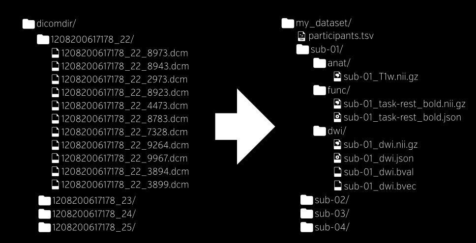

---
jupytext:
  formats: ipynb,md:myst
  text_representation:
    extension: .md
    format_name: myst
    format_version: 0.12
    jupytext_version: 1.6.0
kernelspec:
  display_name: Python 3
  language: python
  name: python3
---

# Duomenų tvarkymas

2020-09-29

- Failų ir direktorijų struktūra
- Python direktorijų ir failų tvarkymo bibliotekos ir darbas su jomis
  - Pathlib, os
  - csv, json, txt
- Paieška: Regex
- Klaidų taisymas

+++

Pirmi žingsniai pradedant duomenų analizę:

- Surasti reikiamus duomenų masyvus
- Importuoti duomenis

## Bendra tvarka

- Nenaudoti failų ir direktorijų varduose šių simbolių:
  - LT ar pan. raidžių
  - skyrybos ženklų (, ? ! ir t.t.)
- Naudoti: (a-z A-Z 0-9 \_)
- Strategijos:
  - Pirmas raides žodžių didžiosiomis raidėmis - VienasDu (CamelCase)
  - Atskirt žodžius apatiniais brūkšniais vienas\_du (snake case)

+++

## Direktorijų struktūra

### Direktorijų medis

Unix kompiuteriuose direktorijas skiria pasvirasis brūkšnys `/`

Windows operacinėse sistemose atgalinis brūkšnys `\`

```{raw-cell}
~/Documents/biod2020/
├── images
│   ├── visualStudioCode.png
│   └── ...
├── lab
│   ├── environment.yml
│   ├── lab1.ipynb
│   ├── lab1.pdf
│   ├── lab2.ipynb
│   ├── lab2.py
│   ├── labreport.ipynb
│   ├── labreport.nbconvert.ipynb
│   ├── labreport.nbconvert.pdf
│   ├── labreport.py
│   ├── lect1_Intro.slides.html
│   └── programa.py
├── lect
│   ├── lect1_Intro.ipynb
│   ├── lect1_Intro.pdf
│   ├── lect1_Intro.py
│   ├── lect2_Python.ipynb
│   ├── lect2_Python.md
│   ├── lect2_Python.py
│   ├── programa2.py
│   └── __pycache__
│       └── programa2.cpython-38.pyc
├── planas.docx
└── README.md

4 directories, 61 files
```

### Rekomenduojama neuromokslų struktūra: bids.neuroimaging.io



+++

### Dažniausiai aptinkama struktūra git projektuose

Failas | Paskirtis
---|---
README.md | Aprašas projekto
LICENSE | choosealicense.com
setup.py | Distribucijos valdymas
requirements.txt | programos reikalavimai
sample/\_\_init\_\_.py | python bibliotekos
sample/core.py | Pagrindinė programa
docs/conf.py | Dokumentacija
docs/index.md | Indeksas
tests/test\_basic.py | Testai

+++

### Minimali struktūra

Failas ar direktorija | Paskirtis
---|---
Code/ | Direktorija skirta skaičiavimų kodui
Data/ | Direktorija skirta duomenims
Text/ | Direktorija skirta tekstu
Text/README.md | Aprašas
Text/Figures/ | Direktorija skirta paveikslams
.gitignore | versijos kontrolė
.git/ | versijos kontrolė

+++

### Failų tipai

- .txt
- .csv
- .xlsx
- .json
- .mat
- .pdf
- .html
- .dat
- t.t.

+++

## Tvarkymas direktorijų ir failų su python

Dažniausiai direktorijų tvarkymas atliekamas keturiomis pakuotėmis:

- os --- operacinės sistemos rutinos
- glob --- paieškos funkcijos
- shutil --- įvairios funkcijos kopijavimui ir pan.
- pathilb  --- nuo python versijos 3.4 atsiradusi `pathlib` pakuotė
gali viena atlikti daugumą direktorijų ir failų tvarkymo veiksmų.

```{code-cell} ipython3
import re
import glob
import os
import shutil
import pathlib
```

### `os`

Dažnai pasitaikanti pakuotė programos sąveikai su operacine sistema valdyti.

+++

Norint gauti namų direktoriją nepriklausomai nuo sistemos:

```{code-cell} ipython3
home_dir = os.path.expanduser("~")
home_dir
```

Jei norime dokumentuose sukurti direktoriją `biologija` negerai būtų ją
aprašyti kaip:

```{code-cell} ipython3
direktorija = '/home/neuro/Documents' + '/biologija'
direktorija
```

arba

```{code-cell} ipython3
direktorija = os.path.expanduser("~") + '/Documents/biologija'
direktorija
```

Kuriant direktorijų pavadinimus svarbu kad jie būtų sukuriami nepriklausomai nuo
sistemos kur bus naudojama programa.

```{code-cell} ipython3
test_dir = os.path.join(home_dir, "Documents", "biod2020", "datatest")
test_file = os.path.join(home_dir, "Documents", "biod2020", "datatest", "test.txt")
test_dir, test_file
```

Galime sukurti aprašytą failą nusiųsdami komandą operacinei sistemai:

```{code-cell} ipython3
os.system(f"mkdir {test_dir}")
os.system(f"touch {test_file}")
```

Arba `os` metodais

```{code-cell} ipython3
os.mkdir(test_dir)
```

Visą medį direktorijų sukuriam

```{code-cell} ipython3
os.makedirs("test/test1/test2", exist_ok=True)
!ls test
```

Pakeisti dabartinę direktoriją

```{code-cell} ipython3
os.chdir(test_dir)
%pwd
```

```{code-cell} ipython3
pwd
```

Sužinom dabartinę direktoriją

```{code-cell} ipython3
current_working_directory = os.getcwd()
current_working_directory
```

Gaunam viduje esančių failų struktūrą

```{code-cell} ipython3
ls
```

```{code-cell} ipython3
dfiles = os.listdir()
dfiles
```

Pakeičiam pavadinimus

```{code-cell} ipython3
test_file2 = os.path.join(home_dir, "Documents",
                          "biod2020", "datatest", "test2.txt")
os.rename(test_file, test_file2)
```

Ištrinam failus

```{code-cell} ipython3
if os.path.isfile(test_file2):
    os.remove(test_file2)
    # os.unlink(file)
else:
    print(f"file {file} does not exist")
```

Ištrinam prieš tai sukurtą direktorijų medį

```{code-cell} ipython3
os.chdir('../lect')
for dirpath, dirnames, files in os.walk("./test", topdown=False):
    try:
        os.rmdir(dirpath)
        #  shutil.rmtree()
    except OSError as ex:
        print(f"Error: {dirpath} : {e.strerror}")
```

Eiti per direktorijas ir sub direktorijas galime funkcija `walk`.

Einame direktorijų medžiu ir ieškome pdf failų.

```{code-cell} ipython3
bioa_dir = os.path.join(home_dir, "Documents", "biod2020")
files = []
# r=root, d=directories, f = files
for r, d, f in os.walk(bioa_dir, topdown=True):
    #   print(r, f, d)
    for file in f:
        if ".pdf" in file:
            files.append(os.path.join(r, file))

for f in files:
    print(f)
```

Plėtinius galima ieškoti ir su `endswith` metodu

```{code-cell} ipython3
for r, d, f in os.walk("./"):
    for file in f:
        if file.endswith(".pdf"):  # startswith
            print(file)
```

### glob

Paprastesnis būdas ieškoti failų su glob pakote

```{code-cell} ipython3
os.chdir(bioa_dir)
glob.glob("**/*.pdf", recursive=True)
```

\*\* nurodo ieškoti ir subdirektorijose

rglob metodas ieškotu subdirektorijose ir be dviejų žvaigždučių

+++

Glob paieškos specifiniai simboliai:

Simbolis | Reikšmė
---|---
\* | pakeičiamas į 0 arba daugiau simbolių (l*.pdf surastų tiek lect1.pdf tiek ir lab1.pdf)
\? |  pakeičiamas į vieną betkokį simbolį (l??.pdf sureas tik lab.pdf)
[seq] | surandą simbolius nurodytus tarp skliaustų ([0-9] [a-z] ieškos simbolių šiuose atkarpose)
[!seq] | atvirkštinis variantas ieškos simbolių nesančių sąraše

```{code-cell} ipython3
for name in glob.glob("**/*[1-9]*.ipynb", recursive=True):
    print(name)
```

>> **UŽDUOTIS**
>>
>> Raskite visus py failus
>>
---
```

### shutil

Kopijavimas

```{code-cell} ipython3
os.system(f"touch {test_file}")
shutil.copy(test_file, test_file2)  # same as cp in shell, preserves metadata
```

```{code-cell} ipython3
shutil.copytree(source_directory, destination_directory)
```

```{code-cell} ipython3
shutil.move(souce, destination)  # files or directories
```

```{code-cell} ipython3
help(os)
```

```{code-cell} ipython3
help(glob)
```

```{code-cell} ipython3
help(shutil)
```

### pathlib

Pathlib pakuotė sukuria objektus reprezentuojančius direktorijas ir failus.

Tada su pathlib metodais mes modifikuojame sukurtus objektus.

```{code-cell} ipython3
test_file_pathlib = pathlib.Path(test_file)
test_dir_pathlib = pathlib.Path(test_dir)
test_file_pathlib, test_dir_pathlib
```

Dabartinė direktorija

```{code-cell} ipython3
p = pathlib.Path.cwd()
p
```

Namų direktorija

```{code-cell} ipython3
p = pathlib.Path.home()
p
```

Kūrimas universalių nuorodų į failus ir direktorijas

```{code-cell} ipython3
p = pathlib.Path.joinpath(pathlib.Path.home(), "Documents", "biod2020")
p
```

Tikrinimas ar direktorija/failas egzistuoja

```{code-cell} ipython3
p.exists()
```

Tikrinimas ar tai direktorija

```{code-cell} ipython3
p.is_dir()
```

Tikrinimas ar tai failas

```{code-cell} ipython3
p.is_file()
```

Kūrimas direktorijų

```{code-cell} ipython3
test_dir_pathlib.mkdir(parents=True, exist_ok=True)
```

Sukūrimas failo pagal objektą

```{code-cell} ipython3
test_file_pathlib.touch()
```

Keitimas vardo

```{code-cell} ipython3
test_file_pathlib = test_file_pathlib.rename('test2.txt')
```

Ištrynimas direktorijos

```{code-cell} ipython3
test_dir_pathlib.rmdir()
```

Ištrynimas failo

```{code-cell} ipython3
test_file_pathlib.unlink()
```

Paieška failų ir direktorijų

```{code-cell} ipython3
r = p.glob("**/*.pdf")
list(r)
```

Plačiau

```{code-cell} ipython3
---
jupyter:
  outputs_hidden: true
  source_hidden: true
---
help(pathlib.Path)
```

---
>> **UŽDUOTIS**
>>
>> - Naudodami pathlib sukurkite savo direktorijų medį
>> - Naudodami pathlib raskite visus ipynb failus
>>
---

## Tekstiniai failai

Sukuriam failą

```{code-cell} ipython3
test_file_pathlib.touch()
```

Atidarome failą rašymo režime `w` ir įrašyti žodį 'text'

```{code-cell} ipython3
failas = open(test_file_pathlib, "w")
try:
    failas.write("text")
finally:
    failas.close()
```

Komanda | Reikšmė
---|---
'r' | skaitymas (default)
'w' | rašymas, pirma ištrinant
'x' | sukurt naują failą ir įrašyti
'a' | rašymas, pridėti tekstą
'b' | dvejetainis rėžimas

+++

Kad neužmirštume uždaryti failo naudojame konteksto tvarkyklę `with`

Atidarome failą skaitymo rėžime `r` ir nuskaitome visas eilutes

```{code-cell} ipython3
with open(test_file_pathlib, "r") as failas:
    tt = failas.readlines()  # list su visais simboliais
    print(tt)
```

Norėdami skaityti po vieną eilutę

```{code-cell} ipython3
with open(test_file_pathlib, "r") as failas:
    for row in failas:
        print(row, end="")
```

Pathlib pakuotė turi metodus nuskaityti ar įrašyti tekstą į savo objektus.

```{code-cell} ipython3
test_file_pathlib.read_text()
```

```{code-cell} ipython3
test_file_pathlib.write_text("abc")
```

Apjungiant susimuiluojame eksperimento failus.

```{code-cell} ipython3
test_dir_pathlib.mkdir()
for subj in range(1, 11):
    for txt_file in range(1, 11):
        if txt_file < 6:
            measure = "power"
        else:
            measure = "phase"
        p = pathlib.Path.joinpath(
            pathlib.Path.home(),
            "Documents",
            "biod2020",
            "datatest",
            f"Exp_{txt_file}_{measure}_{subj}.txt",
        )
        p.touch()
```

Ištriname direktorijas sukurtas

```{code-cell} ipython3
test_file_pathlib.unlink()


def rm_tree(pth):
    for child in pth.iterdir():
        if child.is_file():
            child.unlink()
        else:
            rm_tree(child)
    pth.rmdir()


rm_tree(test_dir_pathlib)
```

## Regex

Kartais paprastų filtrų neužtenka tiek norint surasti informaciją.

Regex kalba yra universalus būdas (veikiantis visuose programavimo kalbose)
automatizuoti informacijos filtravimą.

Aptarsime tik mažą dalį šios kalbos, plačiau aprašyta
[dokumentacijoje](https://docs.python.org/3/howto/regex.html)

regex sakinių testavimas https://regex101.com/

### Kur galima naudoti regex

Dauguma duomenų analizės uždavinių galima apibūdinti kaip fragmentų paiešką
tekste.

- Radimas failų pavadinimų
- Radimas specifinių duomenų faile
- Analizė teksto sekų (DNR)
- Ištraukimas koordinačių
- Taksonominių vardų
- t.t.

Pavyzdys [regex DNR analizėje](https://pythonforbiologists.com/regular-expressions)

Python pakuotė `re` aprašo regex metodus

+++

### Failų radimas

```{code-cell} ipython3
def find_files_glob(directory, pattern):
    return list(Path(directory).rglob(pattern))


file_list = find_files_glob(bioa_dir, "*py")
file_list
```

Jei mums reikia sudėtingesnės logikos pvz jei norime rasti tik tuos py failus
kurie yra lab arba exam direktorijose.

```{code-cell} ipython3
def find_files_re(directory, pattern):
    # in first for loop we convert to strings pathlib returned directory contents
    files = [str(element) for element in list(Path(directory).rglob("./*"))]
    # in second loop using regular expressions we filter pathlib output
    files = [element for element in files if re.search(pattern, element)]
    return files


file_list = find_files_re(bioa_dir, r".*(exam|lab).*py$")
file_list
```

Pradžioje apžvelgiam regex sakinių konstrukciją ir tada `re` pakuotės metodus.

Kadangi yra daug specialių simbolių formuojant regex sakinius pravartu naudoti
r-strings.

Simboliai | Reikšmė
---|---
\. | Bet koks simbolis išskyrus nauja eilutė
\* | 0 arba daugiau kartų pasikartojanti prieš tai einanti komanda
\+ | 1 arba daugiau kartų
\? | 0 arba 1 kartą
[a] | specifinis simbolis
[a-z] | raidės nuo a iki z
[a-zA-Z0-9\_] | mažosios arba didžiosios raidės, skaičiai ir \_
^ | Jei naudojamas kaip pirmas simbolis tai simbolizuoja eilutės pradžią
[^A] | ne A
$ | eilutės pabaiga
{x,n} | komanda arba simbolis pakartojamas nuo x iki n kartų
(x,x1,..) | grupuojami simboiai
\| | jungtukas arba
\d | skaičius nuo 0 iki 9
\D | tas pats kaip [^0-9]
\s |  tarpas
\S |  ne tarpas
\W | tas pats kaip [^a-zA-Z0-9\_]
\w | tas pats kaip [a-zA-Z0-9\_]
\b | žodžio kraštas
\B | ne kraštas
\  | leidžia naudoti simbolius rezervuotus komandoms
\n | nauja eilutė

#### re metodai

Jei turime kintamąjį HI

```{code-cell} ipython3
HI = "Hello 1 5 world! 5"
```

Ir norime surasti visus skaičius šiame tekste

```{code-cell} ipython3
re.findall(r"\d+", HI)
```

Dažniausiai pradedame kurti paieška įtraukdami viską --- . komanda

```{code-cell} ipython3
re.match(r".*", HI)
```

Metodas `group` gražina aptiktą reikšmę

```{code-cell} ipython3
re.match(r".*", HI).group()
```

```{code-cell} ipython3
re.findall(r"\d+", HI)
```

'\d+' surask bet kokį skaičių `\d` pakartotą `+` 1 arba daugiau kartų

finditer gražina po vieną reikšmes for ciklui

```{code-cell} ipython3
list(re.finditer(r"\d+", HI))
```

`re.search` -  skenuoja tekstą ieškodamas atitinkančio šablono.
Jis panašus į match metodą bet gražina ne vien tik pirmą rastą reikšmę.

Raskime skaičių 5 kuris yra teksto pabaigoje

```{code-cell} ipython3
re.search(r"5$", HI).group()
```

Metodas span gražina simbolių vietą tekste

```{code-cell} ipython3
re.search(r"5$", HI).span()
```

`5` randą skaičių o $ teksto pabaigą

match panašia komanda neranda nieko nes skenuoja nuo pradžių tekstą

```{code-cell} ipython3
re.match(r"5$", HI)
```

`e.split` padalina ties rastais simboliais tekstą į dalis

```{code-cell} ipython3
re.split(r"\s", HI)
```

`\s` randa tarpus tarp žodžių

Padalinam tekstą ties skaičiais

```{code-cell} ipython3
re.split(r"\d", HI)
```

Matome kad skaičiai išnyksta nes ties jais vyksta dalinimas.
Jei norime išlaikyti skaičius juos reik sugauti ()

```{code-cell} ipython3
re.split(r"(\d)", HI)
```

`re.sub` pakeičia į kitas reikšmes

```{code-cell} ipython3
re.sub(r"!", "", HI)
```

Rasti žodžius po kurių seka šauktukas galima su lookahead sintakse (?=x)

```{code-cell} ipython3
re.findall(r"\w+(?=!)", HI)
```

Ir atvirkštinis variantas jei pavyzdžiui nenorime rasti plėtinių pdf arba ipynb

```{code-cell} ipython3
file_list = find_files_re(bioa_dir, r'.*[.](?!pdf$|ipynb$)[^.]*$')
file_list
```

[dokumentacija](https://docs.python.org/3/howto/regex.html)

+++

## Atpažinimas ir ištaisymas klaidų (debugging)

- Bandyt reikia išvengti klaidų ir jų paieškos! :)
- Neįmanoma parašyti kodo be klaidų
- Yra daug įrankių priklausomai nuo užduočių

### Kodo skaitymas

- Kodas yra vykdomas iš viršaus į apačią.
- Importuojami failai paleidžia kitus failus

```{code-cell} ipython3
import math
for item in list(range(10)):
    print(item)
```

### Skaitymas klaidos pranešimo (tracebacks)

```{code-cell} ipython3
from pathlib import Path
path = Path('tt.txt')
txt = path.read_text()
```

- Dažniausiai klaida bus mūsų kode o ne bibliotekoje.
- Paskutinė žinutė praneša apie klaidos tipą

Galimos žinutės ir tipai:

```{code-cell} ipython3
5 ==== 6
```

```{code-cell} ipython3
def fun_(a):
return a
```

```{code-cell} ipython3
prrrint('aaa')
```

```{code-cell} ipython3
a = [2,3,4]
a.te()
```

```{code-cell} ipython3
a[8]
```

Python dokumentacijoje aprašyti visi tipai

+++

### Print

- Dažniausiai pasitaikantis ir lengviausias būdas
- Gerai tinka logikai suprasti kodo, trumpiems algoritmams
- Bet taip pat lėčiausias ir galintis įvelti klaidų.

```{code-cell} ipython3
for n in range(2, 10):
    print(f"n {n}", flush=True)
    for x in range(2, n):
        print(f"x {x}", flush=True)
        if n % x == 0:
            print(n, "equals", x, "*", n // x)
            break
    else: 
        print(n, "is a prime number")
```

### Python debugger (PDB)

- Standard library debugger
- Iš komandinės eilutės paleidžiamas ir galima po žingsnį eiti
- python -m pdb script.py
- arba kode įterpti breakpoint()
- h help
- q quit
- ll dabartinė pozicija kode
- n next
- s step
- c continue
- etc

https://docs.python.org/3.6/library/pdb.html

```{code-cell} ipython3
def prime_detector():
    nonprime=[]
    primes=[]
    for value in range(2, 10):
        for value2 in range(2, value):
            breakpoint()
            if value % value2 == 0:
                nonprime.append(value)
                break
        else:
            primes.append(value)
```

```{code-cell} ipython3
prime_detector()
```

### Jupyter

- %run script
- %debug post-mortem įeina į klaidų paieškos terpę
- %pdb on  --- auto enter ipdb on error

```{code-cell} ipython3
%pdb on
def prime_detector():
    nonprime=[]
    primes=[]
    for value in range(2, 10):
        for value2 in range(2, value):
            if vaue % value2 == 0:
                nonprime.append(value)
                break
        else:
            primes.append(value)

prime_detector()
```

Kai nebereikia nepamiršti išjungti saugant resursus

```{code-cell} ipython3
%pdb off
```

### Pycharm, VSCODE ir kiti

```{code-cell} ipython3
from IPython.display import YouTubeVideo
video = YouTubeVideo(id='nksiGORLDZw', width=400, height=200, fs=1, autoplay=0)
video
```

```{code-cell} ipython3

```
